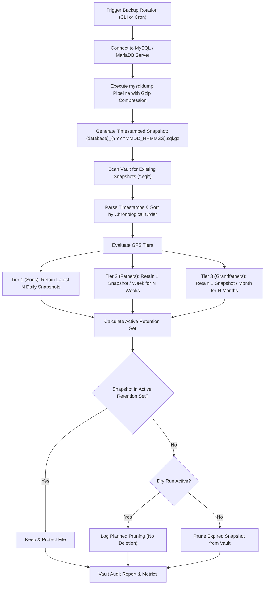

# 🛡️ backup-vault-rotator

> **Topics:** `database-backup` `gfs-retention` `mysql-backup` `devops` `backup-rotation` `disaster-recovery` `sysadmin`


[](https://github.com/shadialhasan/backup-vault-rotator/releases/tag/v1.0.0)
[](LICENSE)
[](https://github.com/shadialhasan)
[](https://github.com/shadialhasan/backup-vault-rotator/actions)
[](https://python.org)

Enterprise-grade database backup rotation utility implementing the **Grandfather-Father-Son (GFS)** lifecycle strategy. Maintains **7 daily (Sons)**, **4 weekly (Fathers)**, and **12 monthly (Grandfathers)** snapshots while safely pruning obsolete and redundant dumps to conserve storage.

---

## 📐 Architecture & GFS Lifecycle Pipeline



---

## ⚡ Key Features

- **True GFS Retention Algorithm**: Intelligent classification into Daily, Weekly (ISO calendar), and Monthly retention buckets.
- **Credential Protection**: Automatic password masking in commands, process logs, and stdout streams.
- **Dry-Run Audit Mode**: Test retention policies and preview pruning actions without modifying or deleting backups.
- **Fail-Safe Operation**: Handles missing mysqldump gracefully with simulation modes for sandbox testing and CI/CD validation.
- **Colored CLI Feedback**: Terminal logging with ANSI color coding and detailed retention metrics.
- **Flexible Configuration**: Configure via command line, `.env` file, or `config.json`.

---

## 🚀 Quick Start

### 1. Installation
```bash
git clone https://github.com/shadialhasan/backup-vault-rotator.git
cd backup-vault-rotator
pip install -r requirements.txt
```

### 2. Configuration
Copy the configuration template or customize `.env`:
```bash
cp .env.example .env
# or use config.json
```

**`config.json` Example:**
```json
{
  "db_host": "localhost",
  "db_user": "root",
  "db_password": "your_secure_password",
  "db_name": "production_erp",
  "backup_dir": "./backups",
  "keep_daily": 7,
  "keep_weekly": 4,
  "keep_monthly": 12,
  "dry_run": false
}
```

### 3. Usage Examples

**Production Database Backup & GFS Rotation:**
```bash
python vault_rotator.py --db production_erp --dir /mnt/backups --user dbadmin --password secret
```

**Dry-Run Audit (Preview what files would be pruned):**
```bash
python vault_rotator.py --db production_erp --dir /mnt/backups --dry-run
```

**Custom Retention Lifecycle:**
```bash
python vault_rotator.py --db analytics --dir ./backups --keep-daily 14 --keep-weekly 8 --keep-monthly 24
```

### 4. Crontab Automation Example
Schedule daily backups at 02:00 AM:
```cron
0 2 * * * cd /opt/backup-vault-rotator && python vault_rotator.py --config config.json >> /var/log/backup_vault.log 2>&1
```

---

## ⚙️ Operational Flags & Options

| Flag | Short | Type | Default | Description |
|---|---|---|---|---|
| `--db` | `-d` | String | *Required* | Database name to dump and rotate |
| `--host` | `-H` | String | `localhost` | MySQL server hostname or IP address |
| `--user` | `-u` | String | `root` | Database username |
| `--password` | `-p` | String | `""` | Database password (masked in all output) |
| `--port` | | Int | `3306` | MySQL server port |
| `--dir` | | String | `./backups` | Vault storage directory |
| `--keep-daily` | | Int | `7` | Number of daily snapshots to retain (Sons) |
| `--keep-weekly` | | Int | `4` | Number of weekly snapshots to retain (Fathers) |
| `--keep-monthly`| | Int | `12` | Number of monthly snapshots to retain (Grandfathers) |
| `--dry-run` | | Flag | `False` | Simulate rotation without deleting files |
| `--config` | `-c` | String | `config.json` | Path to JSON configuration file |
| `--env-file` | | String | `.env` | Path to .env environment variables file |
| `--no-color` | | Flag | `False` | Disable ANSI color codes in console output |

---

## 🧪 Automated Testing

Run the test suite:
```bash
python -m unittest discover -s tests -v
```

---

## 👤 Author & Maintainer

**Eng. MHD. Shadi AL-Hasan**  
- **Role:** Executive CTO & Enterprise Solutions Architect  
- **Email:** [mhd.shadi.alhasan@gmail.com](mailto:mhd.shadi.alhasan@gmail.com)  
- **Phone / WhatsApp:** [+963934005922](tel:+963934005922)  
- **Location:** Damascus, Syria  
- **GitHub:** [shadialhasan](https://github.com/shadialhasan)  

---

## 📄 License

This project is licensed under the MIT License - see the [LICENSE](LICENSE) file for details.  
Copyright (c) 2026 **MHD. Shadi AL-Hasan**. All rights reserved.